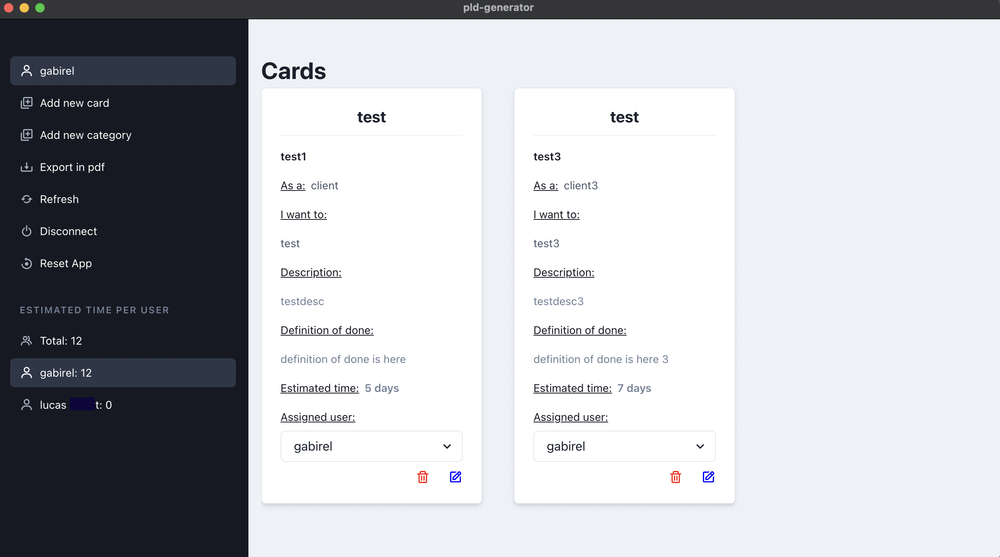

# EIP-PLD-SOLUTION

> This is an all in one solution for your PLD needs.
> It requires little configuration and is easy to use.

## HOW TO USE

First of all, you can download the latest release of the application.
Then, you can run the application by double clicking on the executable file.

However you will need to start the Backend server, host it and do a little configuration first.

## HOW TO BUILD

Go to `application/application`

```cd application/application && yarn build```

go to `dist/` and find your release (.AppImage, .dmg, .exe, .snap)

## Application

If for whatever reason your backend server url changes, make sure to clear the localstorage of the application.
You can do this by opening the developer tools and typing `localStorage.clear()` in the console.
Or by pressing `CTRL + SHIFT + I` and then clicking on the `Application` tab and then on `Clear storage`.

## DEPENDENCIES

There should be no dependencies for the application to run as there will be releases.

You can however choose to build the application yourself if you want to.

To do so you will need `yarn` and `nodejs` installed on your machine.

1. You will also need to install `mysql`.
To configure it you can use the configuration files in the `MySQL-configuration-files` folder. (It doesn't exempt you from creating a user)

```bash
mysql -u root -p < init-db.sql
```

2. Please fill the .env file in the `backend` folder with the correct information. (You can use the .env.example file as a template)

## QUICK LOOK


